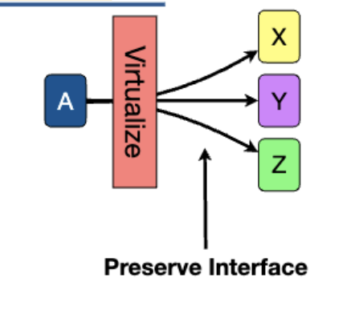
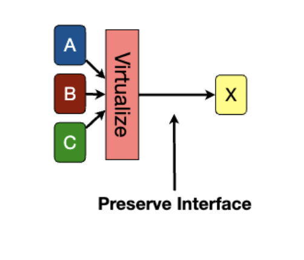
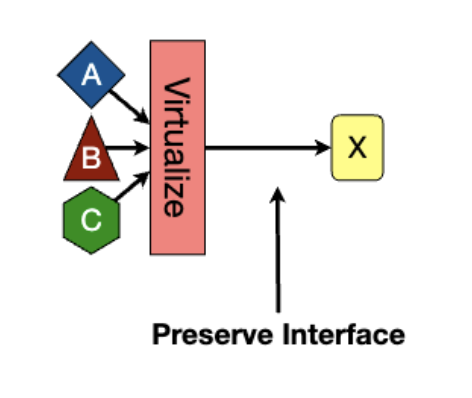

import Image from "astro"

# Day 12 - Virtualization

Client/server good because it forces organization and improves security. (less area of attack)

Client/server bad because you need many machines to run the server. Maybe virtualization can help? Docker time baby!

## Virtualization

Is soft modularity

Three basic techniques:

## Multiplexing

One masquerading as many.

---

One example is Disk Partitions

## Aggregation

Multiple masquerading as one.

## 

---

One example is RAID

## Emulation

Pretend to be something else.

---

One example is a CDN

## Virtual Memory

Gives each process an entire address space, but then behind the scenes coordinates with the OS (and hardware) to share the physical memory.

This lets multiple applications run at the same time without interfering with each other. (unless the entire computer runs out of memory)

### Comm Link: Bounded Buffers

An OS provides bounded buffers which allow threads to communicate via send/receive.

### How to Synchronize Bounded Buffers

One option is a ring buffer. 2 pointers, one for in, and one for out. If they are equal, the buffer is empty. If the in pointer is greater than the out pointer then the buffer has items in it.

However there's a problem because there's no way to tell if the buffer is full or empty. So we need to use a counter variable to keep track of the number of items in the buffer.

However there's a problem because the `++` and `--` operations needed to keep track of the counter is not atomic. So we need to use a mutex to protect the count.
