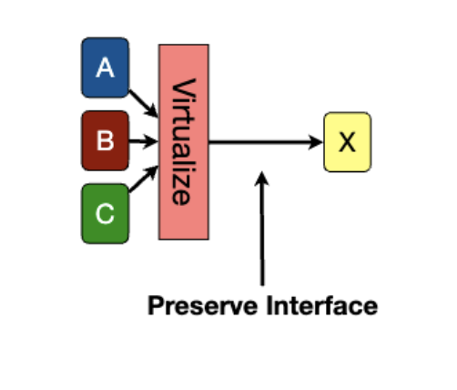

import { Image } from "astro:assets"
import multiplexingImage from "./images/day12/multiplexing.png"

# Day 12 - Virtualization

Client/server good because it forces organization and improves security. (less area of attack)

Client/server bad because you need many machines to run the server. Maybe virtualization can help? Docker time baby!

## Virtualization

Is soft modularity

Three basic techniques:

## Multiplexing

One masquerading as many.

<Image
  src={multiplexingImage}
  alt='One source advertising as many'
  loading='eager'
/>

## Aggregation

Multiple masquerading as one.

## Emulation

Pretend to be something else.

